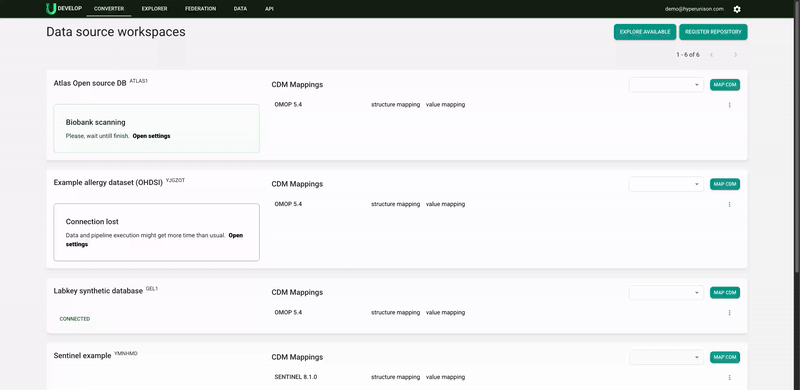
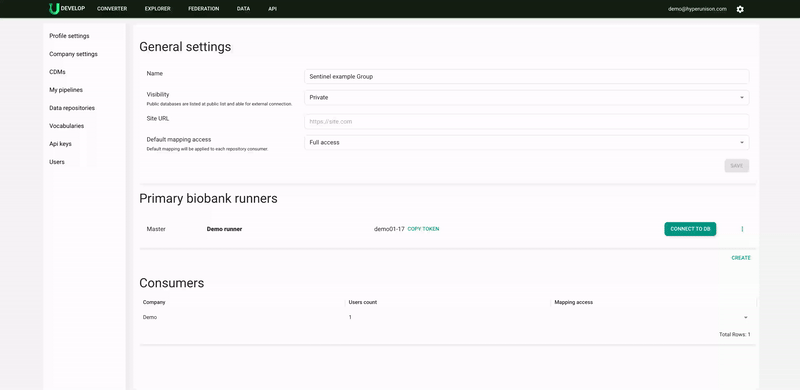
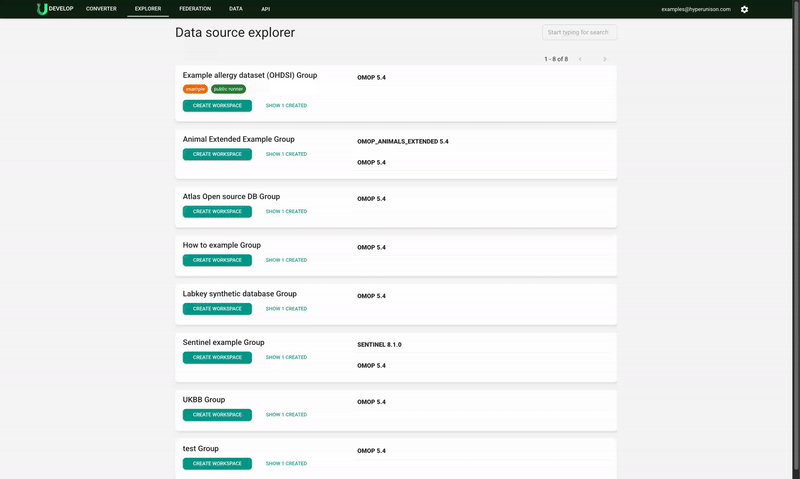
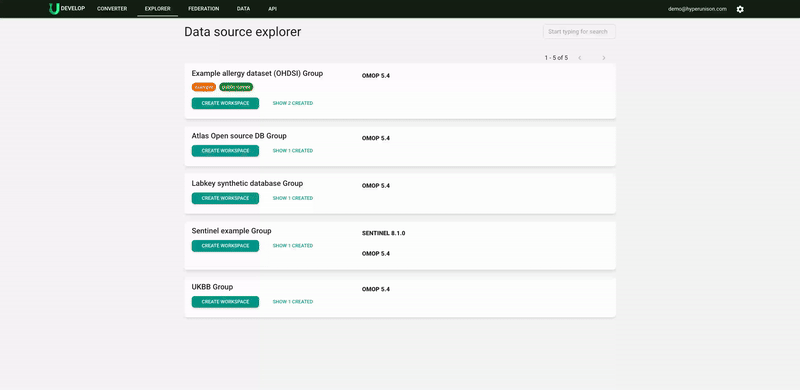
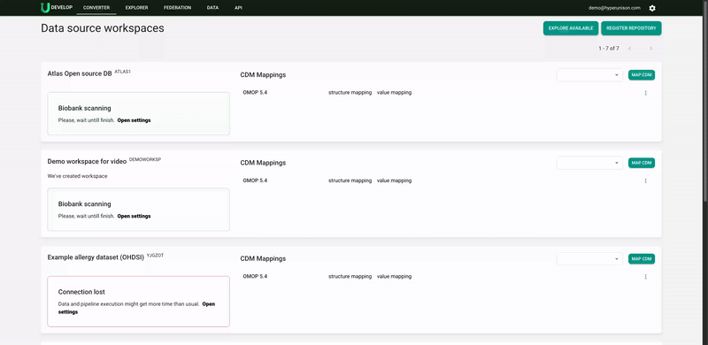
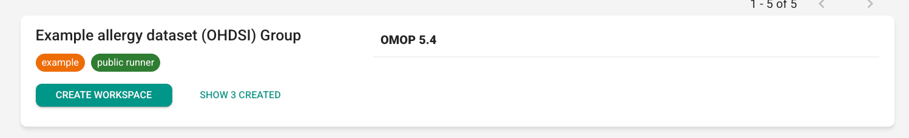

# Principles and core entities

## Overview

The Unison platform employs two core entities to streamline data management: **data sources** and **workspaces**.

A **data source** represents an actual database within the Unison platform. It includes associated access rules, related workspaces, authorised users, and their runners. Data sources can be either private or public:

- **Private data sources** are accessible only to users from the custodian company or other users who are approved by the custodian company to access the data via the Data Explorer.
- **Public data sources** are available to any registered company on the platform.

Data custodians manage a **master workspace**, where they can define structure and value mappings to either standard or custom Common Data Models (CDMs) without requiring data transformation. This setup enables users to start utilising the data efficiently.

Consumers create a **workspace** from the data source, which initially mirrors the master workspace. They can then modify mappings within their granted access levels, ranging from full access to fully protected mappings.

## How workspaces are connected to source datasets / databases

Each user who wants to access a specific dataset for which they have access must create a workspace. This workspace will be available for sign-in to any user from his company or a subset of approved users from their company. To get access, each user should create a runner token and send it to the data custodian. After the data custodian deploys a runner with access to the source database, users from the company will receive access to work with the data in the Unison platform.

## Security and privacy

### Database level

The Unison platform connects to databases using DBMS user credentials. All restrictions and access permissions set at the DBMS level apply within the platform. Users cannot access or utilise data beyond the permissions granted to the DBMS account. Each user connects through these credentials.

This approach allows for flexible and precise access control:

- **Custom DBMS Permissions:** Set specific access permissions at the DBMS level for individual users, enabling detailed control.
- **Shared Company Account:** To simplify and standardise access management, use a single DBMS account for all user runners within a company.
- **Access Profiles:** Create predefined access profiles for different user types and assign them to specific groups, ensuring consistent permissions across teams.

### User roles

User roles in the Unison platform define access to specific parts of the product:

- **Organisation Admin:** Has full access to manage and edit all resources available to the company.
- **Editor:** Can edit mappings, vocabularies, and CDMs, as well as execute pipelines.
- **Viewer:** Can view mappings, utilise the cohort playground, and execute pipelines.

### Mapping accesses

Each data source on the Unison platform requires mapping access to manage editing permissions. There are four access profiles:

- **Full Access:** Users can make any edits to default mappings.
- **SQL Protected:** Users cannot edit or view SQL code but can adjust other mappings as needed. This is useful for setting up data extraction structures while concealing SQL details from consumers.
- **Structure Protected:** Users can view but not edit structure mappings. This option is ideal for safeguarding configured structure mappings while allowing value mappings to be customised for specific research needs.
- **Fully Protected:** Users cannot make any edits to mappings. This ensures the integrity of mappings when providing data as a product, preventing any modifications.

Mapping access must be configured for every user, whether they are part of the data custodian or consumer organisation.

### Mapping management and user roles compatibility

Mapping access controls the ability to edit and manage mappings for specific companies or users.

User roles define which platform sections are accessible and which entities a company or user can modify.

Mapping access rules take precedence over user roles. For example, an editor without mapping edit access cannot make mapping changes, regardless of their role permissions.

## How to provide data to external consumers

### Overview

To grant access to your data on the Unison platform, follow these steps:

1. **Connect your database** to the Unison platform using the master token.
2. **Set up DB access** for the intended user at the DBMS level (or create shared access for multiple users).
3. **Make your data source public** on the Unison platform.
4. For each user requiring access, **install a runner** with the DB access settings created in step 1.

This guide assumes your data source is already connected to the Unison platform.

### What it means to be a data custodian

As a data custodian, you grant access to your data and provide the infrastructure necessary for research.

Responsibilities include:

- **Installing runners** on your infrastructure to enable data access and analysis.
- **Providing resources** for users to execute analysis pipelines.
- **Managing DBMS-level access** to ensure secure data handling.
- **Configuring access** at the Unison platform level for users and workspaces.
- **Updating runner versions** to maintain compatibility and performance.

Typically, the Unison runner operates within the custodian’s infrastructure and must have direct access to the database and analysis pipelines.

### Detailed flow

#### Step 1: Change data source visibility

1. Navigate to **Settings > Company > Data Repositories**.
2. Click the **Settings** button next to the desired data source (your data sources are marked with a settings button).
3. Under **General Settings**, change the visibility to Public (this makes the data source visible to everyone on the Explorer page).
4. Set default mapping access to define user permissions for the data source.

This process ensures your data source is accessible while maintaining control over who can interact with it.

#### Step 2: Provide access upon request

1. **Create a DBMS account** for the new user (or use a shared DBMS account for multiple users).
2. Obtain the **runner instance** from the approved Git repository version.
3. Verify that the runner token includes the **“consumer” identifier**, not the “master” token.
4. **Install the runner** on your infrastructure with network access to the database.
5. Notify the user that they can now start working with the data.

#### Step 3: Configure personal access (optional)

1. Navigate to **Settings > Company > Data Repositories**.
2. Click the **Settings** button for the relevant data source.
3. Under the **Consumer** section, locate the user’s company and click on it.
4. Find the specific user requesting access and configure their **personal mapping permissions**.

## How to start using data from a data custodian

### Overview

1. Open the **Data Explorer**.
2. Locate the **data source** you wish to use for research.
3. Verify that your company hasn’t already created a workspace for this data source (the count of existing workspaces is displayed below the data source description).
4. Click **Create Workspace**.
5. Set up the workspace by entering a **name, unique code**, and a **description** outlining its purpose.

### What it means to be a data consumer

Data consumers utilise data to achieve research goals. They work within workspaces to:

- Create and customise **specific mappings**.
- Build and refine **cohorts**.
- Execute **pipelines** for analysis and insights.

#### Step 1.0: Create a workspace

1. Open the **Explorer** and locate the **data source** you want to use.
2. If you don’t have a DBMS account, contact the **data custodian** to obtain one.
3. If no workspaces exist for the data source, click **Create Workspace**.
4. Provide a **unique code**, **name**, and **description** that clearly outlines the research purpose for easy identification by you and your colleagues.

Note: The first scan of the data, based on the structure mapping, will apply to all users. Ensure the first scan is performed by the user with the most comprehensive access.

  

#### Step 1.1.: Sign in to a workspace

1. Open the **Converter** and locate the data source you want to use.
2. Click the **Sign In** button.
3. Obtain the **runner token**.
4. Send the token to the **data custodian** with a request to add a new runner for your use.

#### Step 2: Send your token to the data custodian and request access to the source dataset or database

The Unison platform generates a token for you, which you must send to the **data custodian** with a request to connect you to the platform.

## Demo data repository

Some repositories at the Unison Explorer are marked with tags, like “demo” or “shared”.

These tags mean that you can make a workspace and test the dataset without making a request to a data custodian. Just create a workspace and add members of your team to it.

## Token types and data access management

The Unison platform uses two token types: **master** and **consumer**.

- Any user can add a data source as a custodian. The platform does not manage or restrict this action.
- When a user creates a data source, a master-prefixed runner token is assigned, granting full control over mapping access rules and user permissions.

As a **data custodian**, it’s crucial to verify that consumers do not attempt to create data sources. This would allow them to manage access rules and grant permissions to users from other organisations.

Alternatively, if you wish to delegate data management, you can allow a trusted third party, such as a general partner, to act as a custodian. They would then create the data source and manage access on your behalf.
