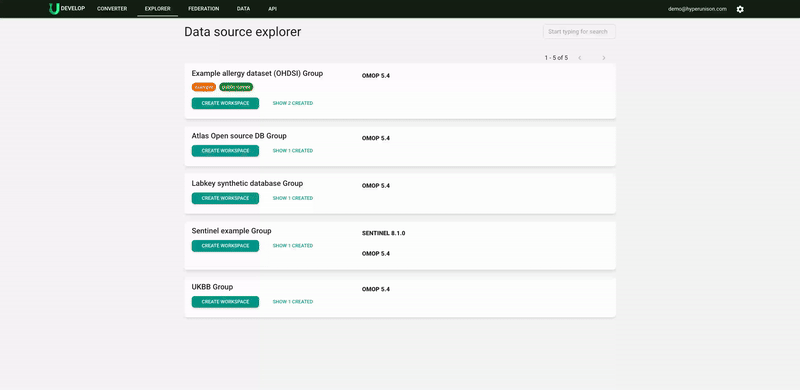
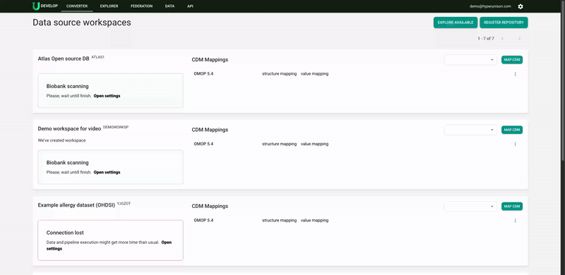

# How to Add an Example Dataset

### What Is the Example Dataset?
For onboarding purposes, we are providing the OHDSI Allergy dataset. [Read more](https://github.com/OHDSI/Tutorial-ETL) about the OHDSI Allergy dataset.

### Example or Training Versions
You can use it in two versions:
- **Example version**: Structured and mapped by the Unison team. Use it as an example and a quick answer to your questions.
- **Training version**: A dataset with empty mappings. Use it as your first work dataset.

### How to Add
1. Click on the "Converter" button in the ribbon at the top of the screen.
2. Then select "Repository with mappings" and click "Add".
3. Go to the converter.
4. Select "Example dataset" in the right top corner.
5. Click "Add".
6. Please be patient, this may take a moment.

  

