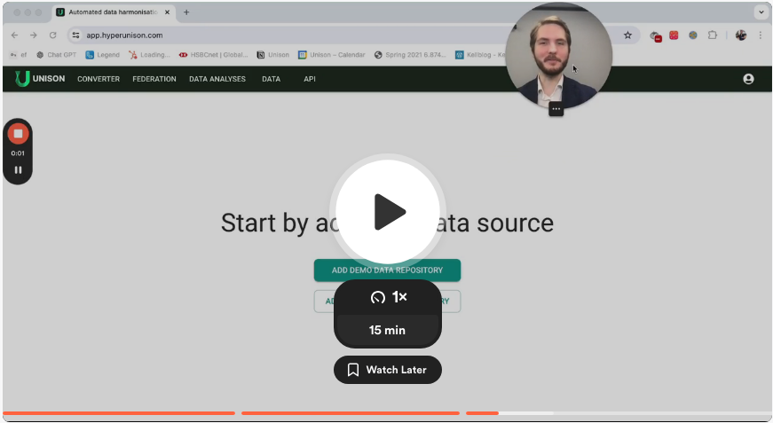

## Unison Platform Overview
The Unison platform aids ETL engineers and bioinformaticians in harmonizing and utilizing data in a federative way.  

### Platform Overview

---
Unison platform consists of 4 core parts:  
- Converter for virtual data mapping
- Data source browser 
- Cohort API and GUI playground
- Downstream analysis API and pipeline management

**Converter**  
The Converter allows you to write short ETL instructions using SQL dialects. It enables virtual harmonization of data without the need to physically transform or extract data to a new database.

**Data Source Browser**  
This tool helps users find and sign up for data sources to use through the Unison platform. Companies can publish their datasets and provide standard database credentials as usual.

**Cohort API and GUI Playground**  
The Cohort API and GUI playground enable you to build a cohort of patients and analyze the distribution of patients with different parameters. The Cohort manager uses scripts written in the Converter in the background.

**Downstream Analysis API and GUI Playground**  
With the Downstream Analysis API and GUI playground, you can upload your analysis tools, manage, and use them.

View this platform overview video.  

### Harmonization Process Overview

---
The Converter allows you to map data to any predefined "public" CDM (such as OMOP 5.4 and Sentinel) and transform data accordingly. You can define your own CDM or extension to each basic CDM.

The Harmonization process consists of two parts:
- **Structure Mapping ("Structure" button)**:  
You write SQL instructions about where to get information and how to link it with the destination data model. During this process, you must decide whether values should be mapped to the vocabulary value.
- **Vocabulary Mapping ("Value" button)**:  
You need to find a vocabulary value for each source value to harmonize the data.

### Federation Process Overview

---
All actions revolve around queries using [UQL - Unison Query Language](../UQL/index.md). Users start by querying to extract data from a data source. This query can be used for cohort distribution exploration and for executing analysis pipelines.

A helicopter view of the process looks like:
- Write a query
- Observe the distribution and data statistics
- Save this query
- Use it later with analysis pipelines

