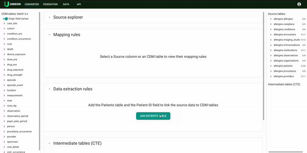
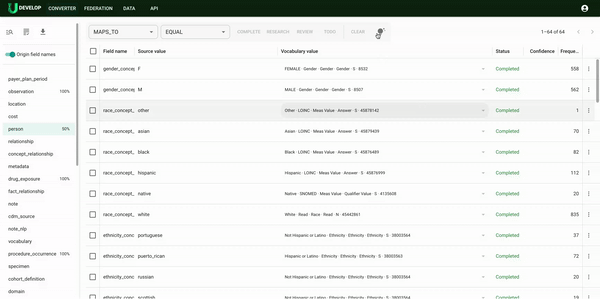

## Quick start guide
> **Warning:** This document assumes that an initial onboarding demo meeting has been completed

### Welcome words 
This document describes a number of steps that users can take to learn the Unison platform quickly. We provide three data table mapping tasks of different levels of complexity: 

 - **easy**: person table
 - **medium**: drug_exposure table
 - **hard**: visit_occurrence

### Step 1: add example dataset
Use this [instruction](../example-dataset/example-dataset.md) and add
"example" and "training" datasets.

This example dataset contains finished mappings that you can explore and use to familiarise yourself with the mapping process within the platform and as a reference for the mapping tasks.

### Step 2: Struсture mapping
[full instructions for structure mapping](../structure-mapping/structure-mapping.md)

Then, map relevant source dataset tables to the OMOP Patient table:

**For the patient table**
- create extraction rule
- describe extractions for each entity field

Once completed, let’s move on to mapping the drug_exposure tables: 

**For drug_exposure table**
- connect source tables `allergy.conditions`, `allergy.medications`, `allergy immunisations` to source patient table `allergies.patients` using SQL joins
- write three extraction rules for drug_exposure entity:
 - from conditions, using SQL join of `allergy.condition` table
 - from medications, using SQL join of `allergy.medications`
 - from immunisations, using SQL join of `allergy.immunisation`
- for each extraction rule define extraction as in example allergy dataset.

Finally, let’s map the visit occurrence table:

**For visit occurrence table**
- [read about CTE](../cte-creation-and-usage/index.md)
- create CTE (copy CTE SQL from example and study SQL script)
- connect CTE to the patient table using SQL joins
- write extraction rule for visit_occureence table

### Step 3: Let’s now move on to the value mapping

> **note**: For each entity and entity field, use the lamp button to generate mapping suggestions.

- go through the values and check suggestions as complete or as research.
- after all values are in completed or research statuses open the research view.
- for each value decide to leave suggestion or change it to more accurate value.

For more details about value mapping, use [value mapping guide](../value-mapping/value-mapping.md)

### Step 4: open cohort API ant test data

- click on a federation tab
- select example and training data sources
- use examples from the examples tab or [full UQL tutorial](../UQL/index.md)
- write query with mapped data
- execute it and look at the distribution
