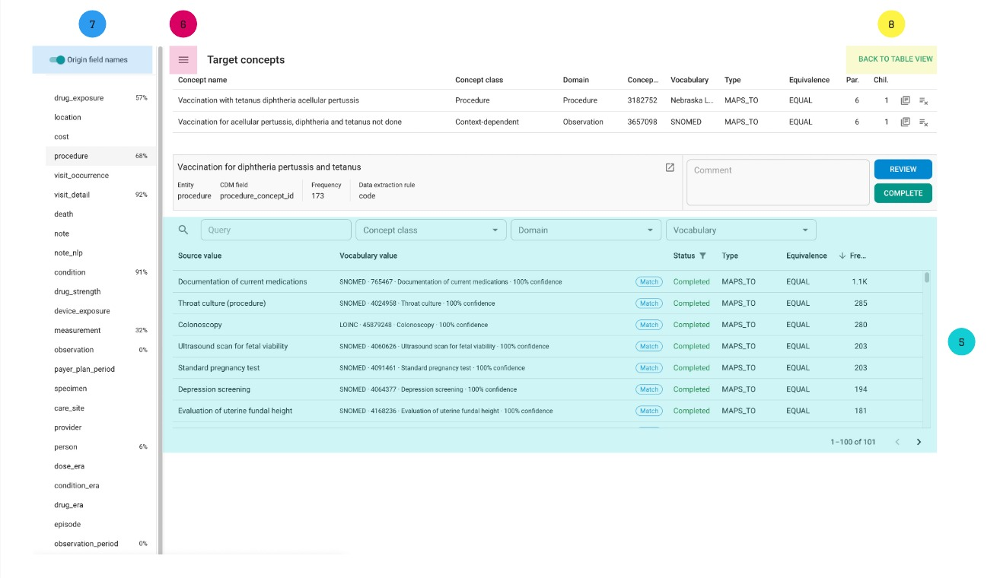

# How Unison Vocabulary Mapping Works

## What is Vocabulary Mapping?

Value mapping is the process of mapping source data to concept IDs from standard and non-standard vocabularies. These relationships are used for data standardization and enable data federation across multiple datasets.

---

## Unison Vocabulary Mapping Process Overview

Unison provides a value mapping process with three steps:

1. **Quick Mapping**: Table view with options for multiple choices and actions, ideal for values with equal concept names or high-confidence values.  
2. **Detailed Research**: A specialized view with more information.  
3. **Mapping Review**.

This process is managed using four mapping statuses:

- **Todo**  
- **Research**  
- **Review**  
- **Complete**

In all interfaces, Unison provides quick access to:

- The **OHDSI Athena** website.  
- A search field for finding concepts.  
- A detailed interface.

---

## Equivalence and Mapping Type

### **Equivalence**

Equivalence definitions are based on the [HL7 concept map equivalence](https://www.hl7.org/fhir/codesystem-concept-map-equivalence.html):

1. **Equal**: The concepts are exactly the same (i.e., intentionally identical).  
2. **Equivalent**: The concepts mean the same thing (i.e., extensionally identical).  
3. **Wider**: The target contains more information than the source.  
4. **Narrower**: The target contains less information than the source.  
5. **Inexact**: The target overlaps with the source, but both source and target cover additional meanings.

### **Mapping Types**

#### **MAPS_TO**

- **Description**: Indicates a direct relationship between one concept and another.  
- **Example**: Diagnosis: Diabetes Mellitus → Concept: "Diabetes Mellitus" in OMOP.

#### **MAPS_TO_VALUE**

- **Description**: Links specific values to concepts, such as lab test results.  
- **Example**: Blood Glucose Level = 5.5 mmol/L → Concept: "Blood Glucose Level" in OMOP.

#### **MAPS_TO_UNIT**

- **Description**: Associates units of measurement with concepts.  
- **Example**: Blood Pressure Unit = mmHg → Concept: "Blood Pressure Measurement" in OMOP.

#### **MAPS_TO_OPERATOR**

- **Description**: Links mathematical/logical operators with concepts.  
- **Example**: Blood Glucose Level > 7 mmol/L → Concept: "Blood Glucose Level" in OMOP.

#### **MAPS_TO_TYPE**

- **Description**: Associates data types (e.g., integer, date) with concepts.  
- **Example**: Data Type: Integer → Concept: "Age" in OMOP.

#### **MAPS_TO_NUMBER**

- **Description**: Maps numerical values directly to concepts.  
- **Example**: Blood Pressure = 120/80 mmHg → Concept: "Blood Pressure Measurement" in OMOP.

---

## Quick Mapping Interface

1. **CDM Data Structure**: Choose the CDM entity for vocabulary mapping.  
2. **Process Menu**:  
   - **Research Button**: Lists values in the research stage.  
   - **Review Button**: Lists values in the review stage.  
   - **Download Button**: Exports mapping results as a spreadsheet.  
3. **Action Menu** for chosen values.  
4. **Table Management** (row names, filters).  
5. **Checkbox** for multiple selections.  
6. **Concept Search Field** (shows suggestions by default).

---

## Detailed Mapping Interface

  

1. **CDM Structure Section**: Select a CDM entity to display source values for mapping. Shows completion percentage.  
2. **Target Concepts Section**: Displays selected concepts.  
3. **Source Value Information Section**:  
   - Source value.  
   - Mapped CDM entity field.  
   - Value frequency.  
   - Link to the extraction rule.  
   - Athena search button.  
   - Mapping controls (status buttons, comments).  
4. **Search Section**: Includes search fields and results, with an option to view mapped values.  
5. **Mapped Values View**: Displays mapped values for reference.  
6. **Menu Toggle Button**: Show/hide the left menu.  
7. **Entity Name Toggle**: Show original/short names of entities.  
8. **Exit to Overview Table**: Returns to the quick mapping view.

---

## Unison Mapping Suggestions

Unison provides algorithmic and AI-based suggestions for vocabulary mapping. It identifies equal values and corner cases using an AI model and calculates a confidence score (0–100%).

Users can specify vocabularies and domains for generating suggestions in the structure mapping view.

---

## Export Mappings

Mappings can be exported as an Excel table for external review or other purposes.

---

## Quick Mapping Workflow

1. Select a CDM field to view source values requiring mapping.  
2. Identify values with matching names, domains, and vocabularies.  
3. Click a row, then click **Complete**.  
4. For multiple selections, use **Ctrl** and click the desired rows.  
5. For alternative suggestions, click values to explore additional options.  
6. Use the three-dots menu to access detailed information via the Athena portal.  
7. If uncertain, click **Review** to move the value to the detailed research process.

---

## Detailed Research Workflow

1. Click **Detailed Research** in the quick mapping view.  
2. Select a CDM entity or view values by frequency.  
3. Review source value information.  
4. Examine search results and suggestions.  
5. Use previous mappings as references.  
6. If no valid suggestions exist, use the **Open in Athena** button to search for concepts.  
7. Add the correct concept(s) to the **Target Concepts** section.  
8. Define equivalence and mapping types.  
9. Click **Review** or **Complete**, as appropriate.

---

## Review Workflow

1. Click **Review** in the quick mapping view.  
2. Select a CDM entity or view values by frequency.  
3. Examine selected target concepts, source value information, and suggestions.  
4. Reference previously mapped concepts for validation.  
5. If changes are needed:  
   - Write a comment and click **Research** to return to the detailed research stage.  
   - Use the search field to refine concepts or filters.  
   - Update target concepts and mapping details.  
6. Click **Complete** to approve mappings.  
